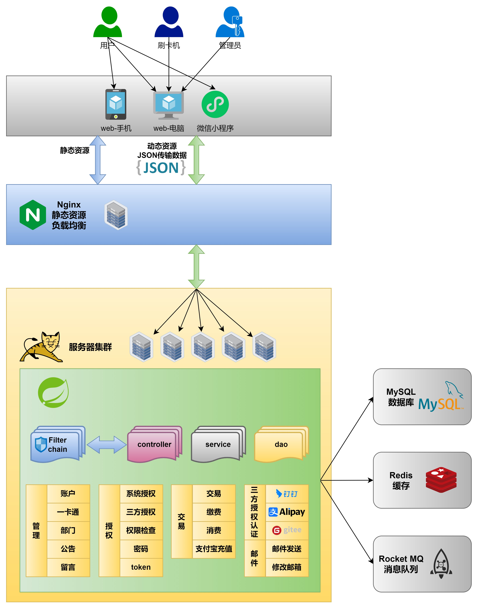

# 🚀 CCMS一卡通管理系统 微信小程序端

> 👨‍💻 芒果小洛 ` `
> 💻 [qkmango.cn](http://qkmango.cn)

# 概览

CCMS一卡通系统（服务端）是一个校园一卡通系统，提供多种功能和管理权限。以下是该系统的主要功能和特点

- 校园一卡通系统：实现了校园内的一卡通管理功能，包括消费信息查询、一卡通信息查询（余额、挂失解挂）、留言板、缴费项目查询和缴费、同班同学用户信息查询等功能。
- 数据存储和安全性：使用Redis进行热点数据的存储，保证数据的快速访问和响应。采用JWT进行权限校验，提供安全的用户身份验证和访问控制。
- 前后端分离：系统采用前后端分离的架构，通过API进行数据传输和交互，实现了前端界面与后端逻辑的解耦和独立开发。
- 支付功能：支持微信小程序扫码支付，支付宝在线扫码充值，方便用户进行支付操作。
- 消息存储与管理：使用RocketMQ进行消息存储和管理，确保消息的可靠传递和处理。
- 第三方授权登录：支持用户通过第三方平台（支付宝、钉钉、gitee）进行授权登录，提供多种登录方式和便捷性。
- 国际化支持：系统实现了请求响应消息的国际化，支持中文和英文两种语言的切换和显示。

管理员具有额外的功能和权限，包括卡管理、消费信息管理、公告管理、留言管理、部门管理、缴费管理、统计图表和个人中心等功能。管理员可以对卡片进行管理（查询、开卡、注销等），管理消费信息和留言，发布公告，管理商家和教学部门，进行缴费管理，查看统计图表等。

刷卡机作为一个重要的设备，在系统中扮演了消费支付的角色，用户可以通过扫描微信小程序端的二维码进行支付，并能够查询刷卡机产生的消费记录。

微信小程序端为用户的移动端，可以进行卡片、账户、交易的信息查询，可以对卡挂解卡，使用二维码消费等功能。

以上是对CCMS一卡通系统（服务端）的综合总结，该系统提供了丰富的功能和管理权限，以支持校园一卡通管理的需求。

# 架构

